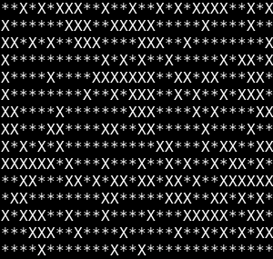
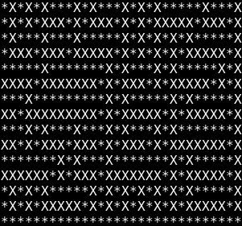

# DANTE's Star
-----------------------------------
Programme de génération et de résulution de labyrinthes

## Présentation

Ce programe est capable de générer des labyrinthes parfait ou imparfait.  
  
Deux types de labyrinthe:  
* Un labyrinthe imparfait contient des boucles, des clusters et ne possède pas forcément de solution.  
  

  

* Un labyrinthe parfait possède forcément un solution et toutes les cases libres sont accessibles.  

  
    
  

-------------
## Utilisation

### Pré-requis