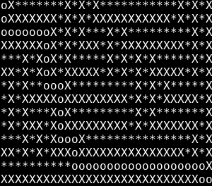

# DANTE's Star
-----------------------------------
Programme de génération et de résolution de labyrinthes

## Présentation

Ce programe est capable de générer des labyrinthes parfait ou imparfait.  
  
__Deux types de labyrinthe:__  
* Le labyrinthe imparfait contient des boucles, des clusters et ne possède pas forcément de solution.  
  


  

* Le labyrinthe parfait possède forcément un solution et toutes les cases libres sont accessibles.  


  
  

__La résolution:__  

  

-------------
## Utilisation

### Pré-requis  

```
gcc
make
```  


### Lancement  
  
__Pour tester le projet chez vous:__  
  
* Compilez le programme au root du répertoire  
```
[DANTE]$ make
```
  
* Générer un labyrinthe
```
[DANTE]$ ./generator/generator [hauteur] [largeur] [parfait]
```  
Si vous voulez un labyrinthe imparfait, ne mettez pas l'arument "parfait"  

* Résoudre un labyrinthe  
```
[DANTE]$ ./solver/solver [labyrinthe]
```  
Mettez en argument le fichier contenant le labyrinthe  


## Langage  
  
* [C](https://fr.wikipedia.org/wiki/C_(langage))  
  

## Auteurs

* __Alexandre CATHALIFAUD__ - [ChoKssa](https://github.com/ChoKssa)  
* __Hugo GROSHAUS__ - [Hugo](https://github.com/ChoKssa)  